# DVOR - System Flowchart

```mermaid
flowchart TD
    Start([🚀 Start DVOR System])
    
    Init[🔧 Initialize System<br/>Launch, Connect Webcam, Load Model]
    
    CheckWebcam{📷 Webcam<br/>Ready?}
    ErrorWebcam[❌ Display Error<br/>Webcam not ready]
    
    Ready[✅ System Ready<br/>Waiting for orange placement]
    
    PlaceOrange[🍊 User Places Orange<br/>on capture platform]
    
    WaitCapture{🖱️ User Presses<br/>Capture?}
    
    CaptureImage[📸 Capture Image<br/>2 Views in Single Frame]
    
    SaveRaw[💾 Save Raw Image<br/>Raw Image]
    
    %% Image Processing
    Preprocess[🔧 Image Preprocessing<br/>Adjust, Reduce Noise, Separate Views]
    
    Segment[✂️ Object Segmentation<br/>Separate Orange & Binary Mask]
    
    CheckSegment{✅ Segmentation<br/>Successful?}
    ErrorSegment[❌ Error<br/>Object Not Found or Unclear]
    
    DetectMarker[📏 Detect Marker<br/>Detect Reference Object]
    
    CheckMarker{✅ Marker<br/>Found?}
    UseDefault[⚠️ Use Default<br/>Calibration]
    
    Calibrate[📐 Scale Calibration<br/>Calculate Pixel/mm ratio]
    
    ExtractFeatures[📊 Feature Extraction<br/>Diameter, Height, Area, Roundness]
    
    CreateVector[📈 Create Feature Vector<br/>Input Data for ML Model]
    
    %% ML Prediction
    LoadModel[🤖 Load ML Model<br/>Load trained model]
    
    Predict[🎯 Volume Prediction<br/>Using ML Model]
    
    PostProcess[📝 Post Processing<br/>Validate & Convert Units]
    
    CheckValid{✅ Volume value<br/>Reasonable?}
    ErrorPrediction[❌ Warning<br/>Abnormal Value Detected]
    
    %% Output
    DisplayResults[🖥️ Display Results<br/>Volume, Images, Features, Confidence]
    
    SaveOption{💾 Save<br/>Results?}
    
    SaveData[💿 Save Data<br/>Images, CSV, Timestamp, Logs]
    
    Continue{🔄 Measure<br/>Next Orange?}
    
    End([🏁 End])
    
    %% Connections
    Start --> Init
    Init --> CheckWebcam
    CheckWebcam -->|No| ErrorWebcam
    ErrorWebcam --> End
    CheckWebcam -->|Yes| Ready
    
    Ready --> PlaceOrange
    PlaceOrange --> WaitCapture
    WaitCapture -->|Wait| WaitCapture
    WaitCapture -->|Capture| CaptureImage
    
    CaptureImage --> SaveRaw
    SaveRaw --> Preprocess
    Preprocess --> Segment
    
    Segment --> CheckSegment
    CheckSegment -->|No| ErrorSegment
    ErrorSegment -->|Retry| WaitCapture
    CheckSegment -->|Yes| DetectMarker
    
    DetectMarker --> CheckMarker
    CheckMarker -->|No| UseDefault
    CheckMarker -->|Yes| Calibrate
    UseDefault --> ExtractFeatures
    Calibrate --> ExtractFeatures
    
    ExtractFeatures --> CreateVector
    CreateVector --> LoadModel
    LoadModel --> Predict
    
    Predict --> PostProcess
    PostProcess --> CheckValid
    CheckValid -->|No| ErrorPrediction
    ErrorPrediction --> DisplayResults
    CheckValid -->|Yes| DisplayResults
    
    DisplayResults --> SaveOption
    SaveOption -->|Yes| SaveData
    SaveOption -->|No| Continue
    SaveData --> Continue
    
    Continue -->|Yes| PlaceOrange
    Continue -->|No| End
    
    %% Styling
    style Start fill:#81c784
    style End fill:#e57373
    style CaptureImage fill:#4fc3f7
    style Predict fill:#ff8a65
    style DisplayResults fill:#ffd54f
    style ErrorWebcam fill:#ef5350
    style ErrorSegment fill:#ef5350
    style ErrorPrediction fill:#ffb74d
    style CheckWebcam fill:#90caf9
    style CheckSegment fill:#90caf9
    style CheckMarker fill:#90caf9
    style CheckValid fill:#90caf9
```



---

## 📖 Flowchart Explanation

### 🟢 **Phase 1: Initialization**

1. **Start System**
   - Launch DVOR program
   - Connect Webcam
   - Load pre-trained Machine Learning Model
   - Check equipment

2. **Check Webcam**
   - ✅ If ready → Continue
   - ❌ If not ready → Display Error and end

---

### 🔵 **Phase 2: Image Capture**

3. **System Ready**
   - Display GUI interface, waiting for user

4. **Place Orange**
   - User places orange on capture platform
   - Adjust position to be within Webcam view

5. **Wait for Capture Command**
   - User presses "Capture" button

6. **Capture Image**
   - Capture from Webcam in a single frame
   - Gets 2 views simultaneously:
     • Top View: Direct overhead view of orange
     • Side View: Side reflection from mirror
   - Save raw image (Raw Image)

---

### 🟡 **Phase 3: Image Processing**

7. **Preprocessing**
   - Adjust brightness, sharpness
   - Reduce noise
   - Separate Top View and Side View images

8. **Segmentation**
   - Separate object (orange) from background
   - Use Color-based segmentation
   - Create Binary mask

9. **Check Segmentation**
   - ✅ Success → Continue
   - ❌ Failure → Display Error, retry capture

10. **Detect Marker**
    - Find Reference object for scale calibration
    - ✅ Found → Use to calculate Pixel/mm
    - ❌ Not found → Use Default value

11. **Scale Calibration**
    - Convert Pixel values → mm/cm

---

### 🟣 **Phase 4: Feature Extraction**

12. **Extract Features**
    - Measure Diameter
    - Measure Height
    - Calculate Area
    - Calculate Roundness
    - Calculate Aspect Ratio

13. **Create Feature Vector**
    - Organize data into Array
    - Ready to input into ML Model

---

### 🔴 **Phase 5: ML Prediction**

14. **Load ML Model**
    - Use pre-trained model

15. **Predict Volume**
    - Input Feature Vector into Model
    - Get predicted volume value (cm³)

16. **Post Processing**
    - Validate reasonable values
    - Round numbers, convert units

17. **Check Validity**
    - ✅ Normal value → Display
    - ⚠️ Abnormal value → Display Warning but still show results

---

### 🟢 **Phase 6: Output & Save**

18. **Display Results**
    - Volume (cm³)
    - Processed images
    - Feature data
    - Confidence score (if available)

19. **Save Option**
    - User chooses whether to save

20. **Save Data** (if selected)
    - Save images
    - Save results as CSV
    - Save Timestamp and Metadata

21. **Continue or End?**
    - ✅ Continue → Place new orange
    - ❌ End → Close program

---

## ⏱️ Estimated Processing Time

| Step | Time (seconds) |
|------|---------------|
| Capture Image | < 1 |
| Preprocessing | 0.5 - 1 |
| Segmentation | 1 - 2 |
| Feature Extraction | 0.5 - 1 |
| ML Prediction | < 0.5 |
| Display Results | < 0.5 |
| **Total** | **~3-6 seconds/orange** |

---

## 🔄 Continuous Operation (Batch Processing)

For measuring multiple oranges in sequence:

```
🍊 Orange #1 → 📸 Capture → 🔄 Process → 🖥️ Display → 💾 Save
                                                            ↓
🍊 Orange #2 → 📸 Capture → 🔄 Process → 🖥️ Display → 💾 Save
                                                            ↓
                                  ...and so on
```

---

## ⚠️ Error Handling

| Error Type | Solution |
|------------|----------|
| **Webcam Not Ready** | Check USB connection / Driver |
| **Cannot Segment Object** | Adjust orange position / Check lighting / Retry capture |
| **Marker Not Found** | Use Default calibration / Notify user |
| **Abnormal Volume Value** | Display Warning / Let user verify |
| **Model Not Found** | Check model file / Retrain |

---

## 🎯 Flowchart Highlights

✅ **Clear:** Shows detailed sequence of operations  
✅ **Error Management:** Every Decision Point has alternatives  
✅ **Flexible:** Can measure multiple oranges continuously  
✅ **Automated:** After image capture, system processes automatically  
✅ **Supports Saving:** Can store data for future use
