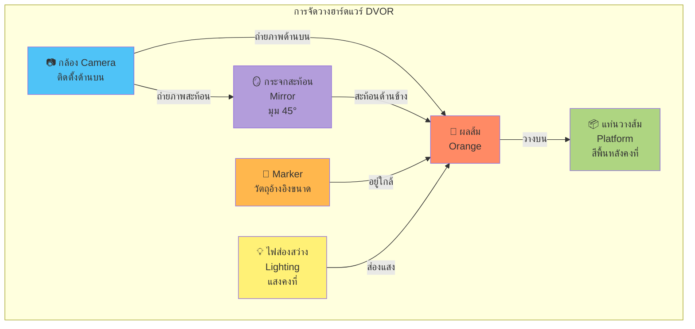

# DVOR - Physical/Geometric Setup



## 📐 รายละเอียดการติดตั้ง

### 1. **กล้อง (Camera)**
- **ตำแหน่ง:** ติดตั้งด้านบนตรงกลาง มองลงมาแนวดิ่ง
- **ระยะห่าง:** ปรับระยะให้ครอบคลุมทั้งผลส้มและกระจกสะท้อนในเฟรมเดียว
- **คุณสมบัติ:** กล้อง RGB ความละเอียดสูง (แนะนำ ≥ 5MP)
- **ฟังก์ชัน:** จับภาพ 2 มุมมองในเฟรมเดียว
  - Top View: มุมมองด้านบนของผลส้มโดยตรง
  - Side View: มุมมองด้านข้างผ่านกระจกสะท้อน

### 2. **กระจกสะท้อน (Mirror)**
- **มุมการวาง:** ประมาณ 45° เทียบกับระนาบแนวนอน
- **ขนาด:** เพียงพอที่จะสะท้อนผลส้มทั้งหมดด้านข้าง
- **ตำแหน่ง:** วางด้านข้างของแท่นวางส้ม
- **วัสดุ:** กระจกเรียบ ไม่บิดเบือนภาพ
- **วัตถุประสงค์:** ช่วยให้ได้มุมมองด้านข้างโดยไม่ต้องใช้กล้องที่ 2

### 3. **แท่นวางส้ม (Platform)**
- **สี:** พื้นหลังสีทึบ (แนะนำสีตัดกับส้ม เช่น สีขาว หรือสีเทา)
- **พื้นผิว:** เรียบ ไม่สะท้อนแสง (matte finish)
- **ขนาด:** เพียงพอสำหรับวางส้มขนาดต่างๆ
- **วัตถุประสงค์:** ช่วยให้แยกวัตถุ (Segmentation) ได้ง่ายขึ้น

### 4. **Marker (วัตถุอ้างอิงขนาด)**
- **รูปแบบ:** วัตถุที่มีขนาดทราบแน่นอน เช่น บล็อกสี่เหลี่ยมขนาด 2×2 cm
- **ตำแหน่ง:** วางใกล้ผลส้มในมุมมองกล้อง
- **สี:** แตกต่างจากผลส้มและพื้นหลังเพื่อให้ตรวจจับได้ง่าย
- **วัตถุประสงค์:** ใช้ปรับเทียบสเกล (Calibration) แปลงจากพิกเซลเป็นหน่วยจริง (mm/cm)

### 5. **แสงสว่าง (Lighting)**
- **ประเภท:** แสงขาว (White LED) หรือแสงธรรมชาติที่สม่ำเสมอ
- **การควบคุม:** แสงคงที่ ไม่กระพริบ หลีกเลี่ยงเงามากเกินไป
- **ตำแหน่ง:** ส่องจากด้านบนหรือด้านข้าง หลีกเลี่ยงการสะท้อนกลับ (glare)
- **วัตถุประสงค์:** ให้ได้ภาพที่ชัดเจน สีสันสม่ำเสมอ

---

## 🔄 มุมมองที่ได้จากการจัดวาง

```
┌─────────────────────────────────────┐
│         📷 กล้อง Camera             │
│              (บน)                   │
└────────────┬────────────────────────┘
             │
             │ จับภาพ
             ▼
┌────────────────────────────────────────────┐
│  เฟรมเดียว (Single Frame)                │
│                                            │
│  ┌──────────────┐   ┌──────────────┐    │
│  │              │   │              │    │
│  │  🍊 Top View │   │ 🍊 Side View │    │
│  │   (ด้านบน)   │   │  (สะท้อน)   │    │
│  │              │   │              │    │
│  └──────────────┘   └──────────────┘    │
│       + 📏              + 📏             │
│      Marker           Marker             │
└────────────────────────────────────────────┘
```

---

## 🎯 ข้อดีของการออกแบบนี้

✅ **ประหยัดต้นทุน:** ใช้กล้องเพียงตัวเดียวแทนการใช้ 2 ตัว  
✅ **ไม่ซับซ้อน:** ไม่ต้องซิงค์การถ่ายภาพหลายกล้อง  
✅ **ข้อมูลครบถ้วน:** ได้ทั้งมุมมองด้านบนและด้านข้างในเฟรมเดียว  
✅ **ติดตั้งง่าย:** ใช้อุปกรณ์ที่หาได้ง่าย  
✅ **ความแม่นยำ:** สามารถปรับเทียบสเกลด้วย Marker

---

## 📌 ข้อควรระวัง

⚠️ **กระจกต้องสะอาด:** หลีกเลี่ยงรอยเปื้อนที่อาจทำให้ภาพเสียหาย  
⚠️ **มุมของกระจก:** ต้องปรับให้แน่นอนเพื่อให้ภาพสะท้อนไม่บิดเบือน  
⚠️ **แสงสะท้อน:** ต้องจัดการแสงไม่ให้เกิดแสงสะท้อนจากกระจกมากเกินไป  
⚠️ **ตำแหน่งส้ม:** ต้องวางในตำแหน่งที่กำหนด เพื่อให้ได้ภาพที่สม่ำเสมอ
