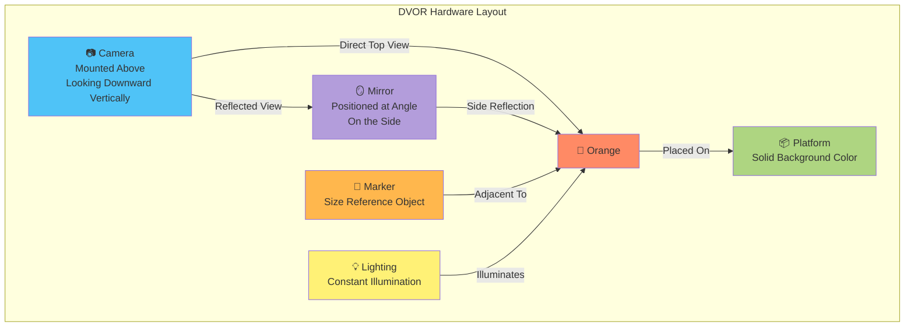

# DVOR - Physical/Geometric Setup



## 📐 Installation Details

### 1. **Camera**
- **Position:** Mounted centrally above, looking downward vertically
- **Distance:** Adjusted to capture both the orange and mirror reflection in a single frame
- **Specification:** High-resolution RGB camera (recommended ≥ 5MP)
- **Function:** Captures 2 views in one frame
  - Top View: Direct overhead view of the orange
  - Side View: Side view via mirror reflection

### 2. **Mirror**
- **Angle:** Positioned at an appropriate angle for optimal side view reflection
- **Size:** Large enough to reflect the entire side view of the orange
- **Position:** Placed beside the platform, at a suitable distance from the orange
- **Material:** Smooth, high-quality mirror that doesn't distort the image
- **Adjustment:** Angle can be adjusted to achieve the clearest reflection
- **Purpose:** Enables side view capture without requiring a second camera, reducing hardware costs

### 3. **Platform**
- **Color:** Solid background color (recommended: white or gray, contrasting with orange)
- **Surface:** Smooth, non-reflective (matte finish)
- **Size:** Adequate for oranges of various sizes
- **Purpose:** Facilitates easier object segmentation

### 4. **Marker (Size Reference Object)**
- **Format:** Object with known precise dimensions, e.g., 2×2 cm square block
- **Position:** Placed near the orange within the camera's field of view
- **Color:** Different from both orange and background for easy detection
- **Purpose:** Used for scale calibration - converting pixels to real units (mm/cm)

### 5. **Lighting**
- **Type:** White LED or consistent natural lighting
- **Control:** Steady, non-flickering light avoiding excessive shadows
- **Position:** Illuminating from above or side, avoiding glare
- **Purpose:** Produces clear images with consistent coloration

---

## 🔄 Capture Mechanism and Resulting Views

### Image Capture Mechanism:
```
         📷 Camera (Mounted Above)
              │
              │ Optical Path
              ├───────────┐
              │           │
              ▼           ▼
     🍊 Top View    🪞 → 🍊 Side View
     (Direct)       (Reflected)
```

### Result in Single Frame:
```
┌────────────────────────────────────────────┐
│         📷 Camera                          │
│      (Looking Downward)                    │
└────────────┬───────────────────────────────┘
             │
             │ Captures Simultaneously
             ▼
┌────────────────────────────────────────────┐
│  Single Frame                              │
│                                            │
│  ┌──────────────┐   ┌──────────────┐    │
│  │              │   │              │    │
│  │  🍊 Top View │   │ 🍊 Side View │    │
│  │   (Direct)   │   │ (Reflected)  │    │
│  │              │   │              │    │
│  └──────────────┘   └──────────────┘    │
│       + 📏              + 📏             │
│      Marker           Marker             │
└────────────────────────────────────────────┘
```

---

## 🎯 Advantages of This Design

✅ **Cost-Effective:** Uses only one camera instead of two  
✅ **Simple:** No need to synchronize multiple cameras  
✅ **Complete Data:** Captures both top and side views in a single frame  
✅ **Easy Installation:** Uses readily available components  
✅ **Accurate:** Scale calibration via Marker enables precise measurements

---

## 📌 Precautions and Tips

### ⚠️ Precautions:

⚠️ **Mirror Cleanliness:** Avoid stains, fingerprints, or dust that may damage the image quality  
⚠️ **Mirror Angle:** Must be properly adjusted to achieve the clearest, undistorted side view within the frame  
⚠️ **Glare:** Manage lighting to avoid excessive reflection from the mirror surface; consider anti-glare coating  
⚠️ **Orange Position:** Must be placed consistently in the designated location for uniform image quality  
⚠️ **Distance:** Maintain consistent distances between camera, mirror, and orange for data uniformity  
⚠️ **Vibration:** Avoid camera or mirror movement during image capture; use stable mounting

### 💡 Installation Tips:

✅ **Test Mirror Angles:** Try multiple angles to find the one producing the clearest side view  
✅ **Use Marker Reference:** Place marker in both direct and reflected views to aid calibration  
✅ **Check Lighting:** Test under various lighting conditions to find optimal settings  
✅ **Document Settings:** Record successful positions and angles for reproducibility
