# DVOR - System Architecture

```mermaid
graph TB
    subgraph "1️⃣ Input Layer - ชั้นการรับข้อมูล"
        Camera[📷 กล้อง<br/>Single Camera]
        Mirror[🪞 กระจกสะท้อน<br/>45° Mirror]
        Light[💡 ระบบแสง<br/>Controlled Lighting]
    end
    
    subgraph "2️⃣ Image Acquisition - การเก็บภาพ"
        Capture[📸 Image Capture Module<br/>จับภาพทั้ง 2 มุมมองในเฟรมเดียว]
        RawImage[(🖼️ Raw Image<br/>ภาพดิบ RGB)]
    end
    
    subgraph "3️⃣ Image Processing - การประมวลผลภาพ"
        Preprocessing[🔧 Image Preprocessing<br/>- ปรับแสง/คอนทราสต์<br/>- ลด Noise<br/>- แยก Top/Side View]
        Segmentation[✂️ Object Segmentation<br/>- แยกส้มจากพื้นหลัง<br/>- ตรวจจับ Marker<br/>- Binary Masking]
        Calibration[📏 Scale Calibration<br/>- ตรวจจับ Marker<br/>- แปลง Pixel → mm/cm]
    end
    
    subgraph "4️⃣ Feature Extraction - การสกัดคุณลักษณะ"
        GeometricFE[📐 Geometric Feature<br/>Extraction<br/>- เส้นผ่านศูนย์กลาง<br/>- ความสูง<br/>- พื้นที่หน้าตัด<br/>- ความกลม]
        FeatureVector[(📊 Feature Vector<br/>ชุดข้อมูลคุณลักษณะ)]
    end
    
    subgraph "5️⃣ AI/ML Module - โมเดลปัญญาประดิษฐ์"
        MLModel[🤖 Machine Learning Model<br/>- Training in Progress<br/>- Trained Model]
        Prediction[🎯 Volume Prediction<br/>ทำนายปริมาตร]
    end
    
    subgraph "6️⃣ Output Layer - ชั้นการแสดงผล"
        Display[🖥️ Display Results<br/>- ค่าปริมาตร cm³<br/>- ภาพที่ประมวลผล<br/>- คุณลักษณะต่างๆ]
        Storage[(💾 Data Storage<br/>- บันทึกภาพ<br/>- บันทึกผลลัพธ์<br/>- Log ข้อมูล)]
    end
    
    subgraph "7️⃣ User Interface - อินเทอร์เฟซผู้ใช้"
        GUI[🖱️ GUI Application<br/>- ปุ่มถ่ายภาพ<br/>- แสดงผล Real-time<br/>- บันทึก/Export]
    end
    
    %% Connections
    Camera -->|ภาพด้านบนของส้ม| Capture
    Mirror -->|ภาพสะท้อนด้านข้าง| Camera
    Light --> Camera
    
    Capture --> RawImage
    RawImage --> Preprocessing
    
    Preprocessing --> Segmentation
    Segmentation --> Calibration
    
    Calibration --> GeometricFE
    GeometricFE --> FeatureVector
    
    FeatureVector --> MLModel
    MLModel --> Prediction
    
    Prediction --> Display
    Display --> Storage
    
    GUI -.->|ควบคุม| Capture
    Display -.->|แสดงใน| GUI
    Storage -.->|เรียกดู| GUI
    
    %% Styling
    style Camera fill:#4fc3f7
    style Mirror fill:#b39ddb
    style MLModel fill:#ff8a65
    style Prediction fill:#ffb74d
    style Display fill:#81c784
    style GUI fill:#fff176
```



---

## 📋 รายละเอียดแต่ละ Layer

### 1️⃣ **Input Layer - ชั้นการรับข้อมูล**

| Component | Function | Technology |
|-----------|----------|------------|
| **Camera** | จับภาพผลส้ม ได้ทั้ง Top View และ Side View (ผ่านกระจก) | RGB Camera (≥5MP) |
| **Mirror** | สะท้อนภาพด้านข้างของส้ม | กระจกเรียบมุม 45° |
| **Lighting** | ให้แสงสว่างสม่ำเสมอ | LED White Light |

---

### 2️⃣ **Image Acquisition - การเก็บภาพ**

- **Image Capture Module**
  - จับภาพในเฟรมเดียว มีทั้ง 2 มุมมอง
  - บันทึกเป็นไฟล์ RGB (JPG/PNG)
  - ความละเอียดสูงเพื่อความแม่นยำ

---

### 3️⃣ **Image Processing - การประมวลผลภาพ**

#### a) **Image Preprocessing**
```
Input: Raw RGB Image
Process:
  - Color correction
  - Noise reduction (Gaussian Blur, Median Filter)
  - Contrast enhancement
  - แยกภาพ Top View และ Side View จากเฟรมเดียว
Output: Processed Images (2 views)
```

#### b) **Object Segmentation**
```
Input: Processed Images
Process:
  - Background subtraction
  - Color-based segmentation (HSV/LAB color space)
  - Edge detection (Canny)
  - Morphological operations (Opening/Closing)
  - Binary masking
Output: Segmented orange object (binary mask)
```

#### c) **Scale Calibration**
```
Input: Segmented Image + Marker
Process:
  - ตรวจจับ Marker (Known size reference object)
  - คำนวณอัตราส่วน: Pixel/mm
  - ใช้ปรับเทียบทุกการวัด
Output: Calibration ratio (px/mm)
```

---

### 4️⃣ **Feature Extraction - การสกัดคุณลักษณะ**

#### Geometric Features:
1. **เส้นผ่านศูนย์กลาง (Diameter)**
   - วัดจาก Top View (D_top)
   - วัดจาก Side View (D_side)

2. **ความสูง (Height)**
   - วัดจาก Side View

3. **พื้นที่หน้าตัด (Cross-sectional Area)**
   - คำนวณจาก Top View
   - A = π × (D_top/2)²

4. **ความกลม (Roundness/Circularity)**
   - R = 4π × Area / Perimeter²
   - ใช้ประเมินความไม่สมมาตร

5. **อัตราส่วน (Aspect Ratio)**
   - Height / Diameter

**Output:** Feature Vector = [D_top, D_side, Height, Area, Roundness, Aspect_Ratio, ...]

---

### 5️⃣ **AI/ML Module - โมเดลปัญญาประดิษฐ์**

#### Machine Learning Pipeline:

```
Input: Feature Vector (n features)
         ↓
    [ML Model]
    - Machine Learning Algorithm
    - Model Development in Progress
         ↓
Output: Predicted Volume (cm³)
```

#### Training Process:
```
1. เก็บข้อมูล: ภาพส้ม + วัดปริมาตรจริง (Water displacement)
2. สกัด Features จากภาพ
3. แบ่งข้อมูล: Train/Validation/Test set
4. ฝึก Model หลายแบบ
5. เลือก Model ที่ดีที่สุด
6. Optimize hyperparameters
7. Deploy โมเดล
```

---

### 6️⃣ **Output Layer - ชั้นการแสดงผล**

#### Display Results:
- **ค่าปริมาตร:** แสดงเป็น cm³ หรือ ml
- **ภาพที่ประมวลผล:** แสดงภาพทั้ง 2 มุมมองพร้อม annotation
- **คุณลักษณะ:** แสดงข้อมูล diameter, height, area
- **ความมั่นใจ:** แสดง confidence score (ถ้ามี)

#### Data Storage:
- บันทึกภาพต้นฉบับ
- บันทึกผลลัพธ์การวัด (CSV/Database)
- Log timestamp และข้อมูลอื่นๆ
- ใช้สำหรับ retrain model หรือ analysis ภายหลัง

---

### 7️⃣ **User Interface - อินเทอร์เฟซผู้ใช้**

#### GUI Features:
- **Preview Window:** แสดงภาพจากกล้องแบบ real-time
- **Capture Button:** ปุ่มถ่ายภาพและเริ่มประมวลผล
- **Results Panel:** แสดงผลลัพธ์การวัด
- **Save/Export:** บันทึกข้อมูลเป็นไฟล์
- **Settings:** ปรับแต่งพารามิเตอร์

---

## 🔧 Technology Stack

| Layer | Technology/Library |
|-------|-------------------|
| **Programming Language** | Python |
| **Image Processing** | OpenCV, PIL/Pillow, scikit-image |
| **Feature Extraction** | NumPy, SciPy |
| **Machine Learning** | scikit-learn, TensorFlow/PyTorch |
| **GUI** | Tkinter / PyQt / Streamlit |
| **Data Storage** | SQLite / CSV / JSON |

---

## 📊 Data Flow Summary

```
🍊 ส้ม → 📷 กล้อง+🪞กระจก → 🖼️ ภาพดิบ (2 views) → 
🔧 ประมวลผลภาพ → ✂️ แยกวัตถุ → 📏 ปรับสเกล → 
📐 สกัดคุณลักษณะ → 🤖 โมเดล AI → 🎯 ปริมาตร → 
🖥️ แสดงผล → 💾 บันทึกข้อมูล
```

---

## ⚙️ System Requirements

### Hardware:
- ✅ กล้อง RGB (5MP ขึ้นไป)
- ✅ กระจกสะท้อนเรียบ
- ✅ ระบบไฟส่องสว่าง LED
- ✅ คอมพิวเตอร์ (CPU: i5 ขึ้นไป, RAM: 8GB ขึ้นไป)

### Software:
- ✅ Python 3.8+
- ✅ OpenCV 4.x
- ✅ scikit-learn / TensorFlow
- ✅ NumPy, Pandas
- ✅ GUI Framework

---

## 🎯 ข้อดีของสถาปัตยกรรมนี้

✅ **Modular Design:** แต่ละโมดูลแยกกันชัดเจน พัฒนาและแก้ไขง่าย  
✅ **Scalable:** สามารถเพิ่ม features หรือปรับปรุง model ได้  
✅ **Cost-effective:** ใช้กล้องเดียว ลดต้นทุน  
✅ **Automated:** ประมวลผลอัตโนมัติหลังถ่ายภาพ  
✅ **Non-destructive:** ไม่ทำลายตัวอย่างส้ม
