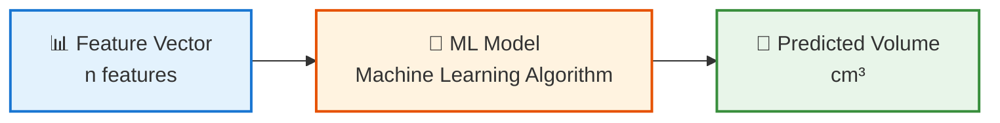

# 🍊 DVOR System Architecture

## 📐 System Architecture Diagram

```mermaid
graph TB
    %% Input Layer
    subgraph Input["1️⃣ Input Layer"]
        direction LR
        Webcam[📷 Webcam<br/>Single RGB Webcam]
        Mirror[🪞 Mirror<br/>Angled Position]
        Light[💡 Lighting<br/>Controlled LED Light]
    end
    
    %% Image Acquisition
    subgraph Acquisition["2️⃣ Image Acquisition"]
        direction TB
        Capture[📸 Image Capture Module<br/>Captures both views in single frame]
        RawImage[(🖼️ Raw Image<br/>RGB Image Data)]
    end
    
    %% Image Processing
    subgraph Processing["3️⃣ Image Processing"]
        direction TB
        Preprocessing[🔧 Image Preprocessing<br/>• Adjust brightness/contrast<br/>• Noise reduction<br/>• Separate Top/Side View]
        Segmentation[✂️ Object Segmentation<br/>• Separate orange from background<br/>• Detect Marker<br/>• Binary Masking]
        Calibration[📏 Scale Calibration<br/>• Detect Marker<br/>• Convert Pixel → mm/cm]
    end
    
    %% Feature Extraction
    subgraph Features["4️⃣ Feature Extraction"]
        direction TB
        GeometricFE[📐 Geometric Feature Extraction<br/>• Diameter<br/>• Height<br/>• Cross-sectional Area<br/>• Roundness]
        FeatureVector[(📊 Feature Vector<br/>Feature Data Set)]
    end
    
    %% AI/ML Module
    subgraph AI["5️⃣ AI/ML Module"]
        direction TB
        MLModel[🤖 Machine Learning Model<br/>• Training in Progress<br/>• Trained Model]
        Prediction[🎯 Volume Prediction<br/>Predict Volume in cm³]
    end
    
    %% Output Layer
    subgraph Output["6️⃣ Output Layer"]
        direction TB
        Display[🖥️ Display Results<br/>• Volume value cm³<br/>• Processed images<br/>• All features]
        Storage[(💾 Data Storage<br/>• Save images<br/>• Save results<br/>• Log data)]
    end
    
    %% User Interface
    subgraph UI["7️⃣ User Interface"]
        GUI[🖱️ GUI Application<br/>• Capture button<br/>• Real-time display<br/>• Save/Export]
    end
    
    %% Connections
    Webcam -->|Direct top view of orange| Capture
    Mirror -->|Reflected side view| Webcam
    Light -->|Illuminates| Webcam
    
    Capture --> RawImage
    RawImage --> Preprocessing
    Preprocessing --> Segmentation
    Segmentation --> Calibration
    Calibration --> GeometricFE
    GeometricFE --> FeatureVector
    FeatureVector --> MLModel
    MLModel --> Prediction
    Prediction --> Display
    Display --> Storage
    
    GUI -.->|Control| Capture
    Display -.->|Display in| GUI
    Storage -.->|Retrieve| GUI
    
    %% Styling
    classDef inputStyle fill:#E3F2FD,stroke:#1976D2,stroke-width:3px,color:#000
    classDef processStyle fill:#F3E5F5,stroke:#7B1FA2,stroke-width:3px,color:#000
    classDef aiStyle fill:#FFF3E0,stroke:#E65100,stroke-width:3px,color:#000
    classDef outputStyle fill:#E8F5E9,stroke:#388E3C,stroke-width:3px,color:#000
    classDef uiStyle fill:#FCE4EC,stroke:#C2185B,stroke-width:3px,color:#000
    
    class Webcam,Mirror,Light,Capture,RawImage inputStyle
    class Preprocessing,Segmentation,Calibration,GeometricFE,FeatureVector processStyle
    class MLModel,Prediction aiStyle
    class Display,Storage outputStyle
    class GUI uiStyle
```



---

## 📋 Layer Details

### 1️⃣ **Input Layer**

| Component | Function | Technology |
|-----------|----------|------------|
| **📷 Webcam** | Captures orange in both Top View (direct) and Side View (reflected) in single frame | RGB Webcam (≥5 MP) |
| **🪞 Mirror** | Reflects side view of orange, positioned at appropriate angle | High-quality smooth mirror |
| **💡 Lighting** | Provides consistent illumination | LED White Light |

---

### 2️⃣ **Image Acquisition**

**📸 Image Capture Module**
- Captures 2 views in a single frame
- Saves as RGB file (JPG/PNG)
- High resolution for accuracy

---

### 3️⃣ **Image Processing**

#### a) **🔧 Image Preprocessing**

```yaml
Input: Raw RGB Image

Process:
  - Color correction
  - Noise reduction (Gaussian Blur, Median Filter)
  - Contrast enhancement
  - Separate Top View and Side View from single frame

Output: Processed Images (2 views)
```

#### b) **✂️ Object Segmentation**

```yaml
Input: Processed Images

Process:
  - Background subtraction
  - Color-based segmentation (HSV/LAB color space)
  - Edge detection (Canny)
  - Morphological operations (Opening/Closing)
  - Binary masking

Output: Segmented orange object (binary mask)
```

#### c) **📏 Scale Calibration**

```yaml
Input: Segmented Image + Marker

Process:
  - Detect Marker (Known size reference object)
  - Calculate ratio: Pixel/mm
  - Use for all measurements

Output: Calibration ratio (px/mm)
```

---

### 4️⃣ **Feature Extraction**

#### Geometric Features:

1. **Diameter**
   - Measured from Top View (D_top)
   - Measured from Side View (D_side)

2. **Height**
   - Measured from Side View

3. **Cross-sectional Area**
   - Calculated from Top View
   - A = π × (D_top/2)²

4. **Roundness/Circularity**
   - R = 4π × Area / Perimeter²
   - Used to assess asymmetry

5. **Aspect Ratio**
   - Height / Diameter

**Output:** FeatureVector = [D_top, D_side, Height, Area, Roundness, Aspect_Ratio, ...]

---

### 5️⃣ **AI/ML Module**

#### Machine Learning Pipeline:



#### Training Process:

1. ✅ Collect data: Orange images + actual volume measurement (Water displacement)
2. ✅ Extract Features from images
3. ✅ Split data: Train/Validation/Test set
4. ✅ Train multiple Models
5. ✅ Select best Model
6. ✅ Optimize hyperparameters
7. ✅ Deploy model

---

### 6️⃣ **Output Layer**

#### Display Results:
- **Volume Value:** Displayed in cm³ or ml
- **Processed Images:** Shows both views with annotations
- **Features:** Display diameter, height, area data
- **Confidence:** Display confidence score (if available)

#### Data Storage:
- Save original images
- Save measurement results (CSV/Database)
- Log timestamp and other metadata
- Use for retraining model or later analysis

---

### 7️⃣ **User Interface**

#### GUI Features:
- **Preview Window:** Shows real-time Webcam feed
- **Capture Button:** Button to photograph and start processing
- **Results Panel:** Display measurement results
- **Save/Export:** Save data to file
- **Settings:** Adjust parameters

---

## 🔧 Technology Stack

| Layer | Technology/Library |
|-------|-------------------|
| **Programming Language** | Python 3.8+ |
| **Image Processing** | OpenCV, PIL/Pillow, scikit-image |
| **Feature Extraction** | NumPy, SciPy |
| **Machine Learning** | scikit-learn, TensorFlow/PyTorch |
| **GUI** | Tkinter/PyQt/Streamlit |
| **Data Storage** | SQLite/CSV/JSON |

---

## 📊 Data Flow Summary

```mermaid
graph LR
    A[🍊 Orange] --> B[📷 Webcam + 🪞 Mirror]
    B --> C[🖼️ Raw Image<br/>2 views]
    C --> D[🔧 Image Processing]
    D --> E[✂️ Segmentation]
    E --> F[📏 Scale Calibration]
    F --> G[📐 Feature Extraction]
    G --> H[🤖 AI Model]
    H --> I[🎯 Volume]
    I --> J[🖥️ Display]
    J --> K[💾 Save Data]
    
    style A fill:#FFE0B2,stroke:#E65100,stroke-width:3px
    style H fill:#FFF3E0,stroke:#E65100,stroke-width:3px
    style I fill:#E8F5E9,stroke:#388E3C,stroke-width:3px
    style J fill:#E3F2FD,stroke:#1976D2,stroke-width:3px
    style K fill:#F3E5F5,stroke:#7B1FA2,stroke-width:3px
```



---

## ⚙️ System Requirements

### Hardware:
- ✅ RGB Webcam (5 MP or higher)
- ✅ Smooth mirror
- ✅ LED lighting system
- ✅ Computer (CPU: i5 or better, RAM: 8GB or more)

### Software:
- ✅ Python 3.8+
- ✅ OpenCV 4.x
- ✅ scikit-learn/TensorFlow
- ✅ NumPy, Pandas
- ✅ GUI Framework

---

## 🎯 Architecture Advantages

✅ **Modular Design:** Each module is clearly separated, easy to develop and modify

✅ **Scalable:** Can add features or improve model easily

✅ **Cost-effective:** Uses single Webcam, reducing costs

✅ **Automated:** Processes automatically after image capture

✅ **Non-destructive:** Does not damage the orange sample

✅ **Real-time:** Fast processing for immediate results

✅ **Accurate:** Uses multiple features and ML for precise volume prediction