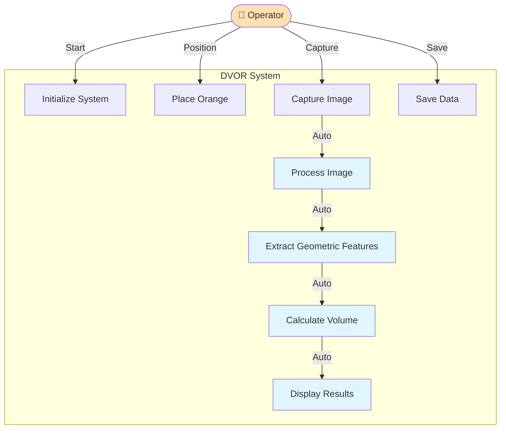

# DVOR - Use Case Diagram

## Use Case Details

### 🔵 Use Case 1: Initialize System
- **Actor:** Operator
- **Description:** Start the DVOR program and verify Webcam and system readiness
- **Precondition:** Hardware system is ready for operation

### 🔵 Use Case 2: Place Orange
- **Actor:** Operator
- **Description:** Position the orange at the designated spot within the Webcam and mirror's field of view
- **Precondition:** System is initialized

### 🔵 Use Case 3: Capture Image
- **Actor:** Operator
- **Description:** Press the capture button to photograph the orange. The system captures both top view and side view (via mirror reflection) in a single frame
- **Postcondition:** Raw image with both views is obtained

### 🔵 Use Case 4: Process Image
- **Actor:** System (Automated)
- **Description:** System separates top and side views, applies image enhancement, performs object segmentation, and reduces noise
- **Technology:** Image Processing, Segmentation

### 🔵 Use Case 5: Extract Geometric Features
- **Actor:** System (Automated)
- **Description:** Measure and extract various features:
  - Diameter
  - Height
  - Cross-sectional Area
  - Roundness
  - Detect Marker for scale calibration
- **Technology:** Feature Extraction, Computer Vision

### 🔵 Use Case 6: Calculate Volume
- **Actor:** System (Automated)
- **Description:** Use Machine Learning model to calculate volume from extracted features
- **Technology:** Machine Learning Model

### 🔵 Use Case 7: Display Results
- **Actor:** System (Automated)
- **Description:** Display volume value, processed images, and feature data on screen
- **Output:** Volume (cm³/ml), Analyzed images

### 🔵 Use Case 8: Save Data
- **Actor:** Operator
- **Description:** Save results and images for further analysis or model training
- **Postcondition:** Data is stored in database or file

---

## 📝 Notes
- Use Cases 4-7 execute automatically and sequentially after the user captures the image
- System is designed for ease of use, minimizing operator workload
