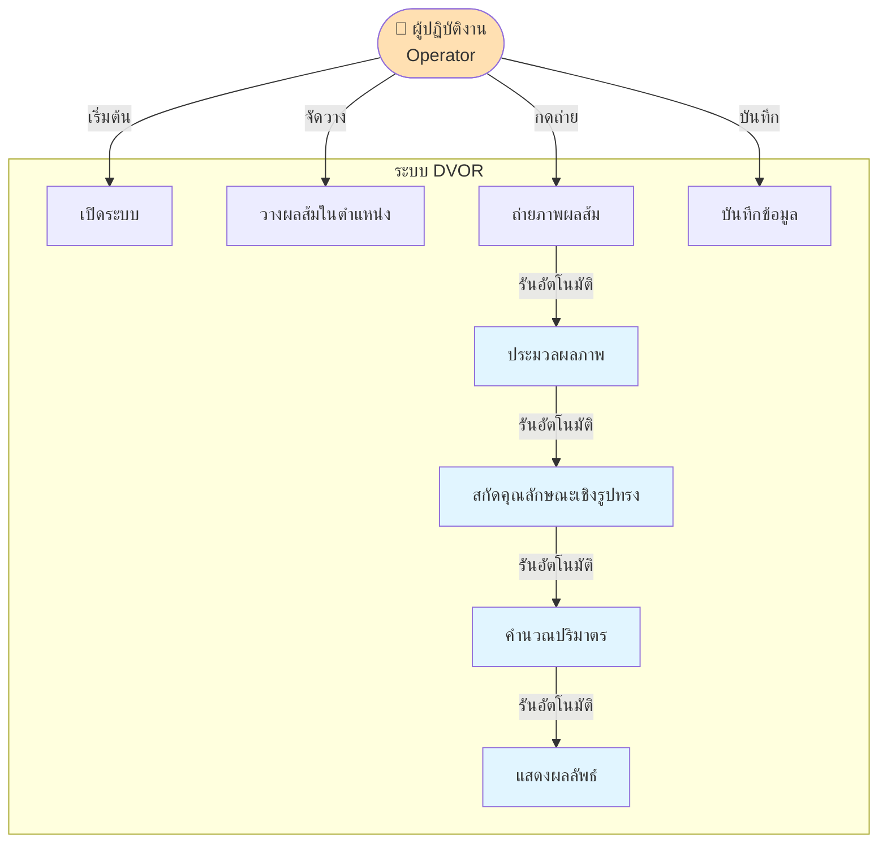

# DVOR - Use Case Diagram

## รายละเอียด Use Cases

### 🔵 Use Case 1: เปิดระบบ
- **Actor:** ผู้ปฏิบัติงาน (Operator)
- **Description:** เปิดโปรแกรม DVOR และตรวจสอบความพร้อมของกล้องและระบบ
- **Precondition:** ระบบฮาร์ดแวร์พร้อมใช้งาน

### 🔵 Use Case 2: วางผลส้มในตำแหน่ง
- **Actor:** ผู้ปฏิบัติงาน
- **Description:** วางผลส้มในจุดที่กำหนดไว้ให้อยู่ในมุมมองกล้องและกระจกสะท้อน
- **Precondition:** ระบบเปิดอยู่

### 🔵 Use Case 3: ถ่ายภาพผลส้ม
- **Actor:** ผู้ปฏิบัติงาน
- **Description:** กดปุ่มเพื่อถ่ายภาพผลส้ม ระบบจะจับภาพทั้งมุมมองด้านบนและด้านข้าง (จากกระจกสะท้อน) ในเฟรมเดียว
- **Postcondition:** ได้ภาพดิบที่มีทั้ง 2 มุมมอง

### 🔵 Use Case 4: ประมวลผลภาพ
- **Actor:** ระบบ (Automated)
- **Description:** ระบบแยกภาพด้านบนและด้านข้าง ทำการปรับแต่งภาพ แยกวัตถุ และลดสัญญาณรบกวน
- **Technology:** Image Processing, Segmentation

### 🔵 Use Case 5: สกัดคุณลักษณะเชิงรูปทรง
- **Actor:** ระบบ (Automated)
- **Description:** วัดและสกัดค่าคุณลักษณะต่างๆ
  - เส้นผ่านศูนย์กลาง (Diameter)
  - ความสูง (Height)
  - พื้นที่หน้าตัด (Cross-sectional Area)
  - ความกลม (Roundness)
  - ตรวจจับ Marker เพื่อปรับเทียบสเกล
- **Technology:** Feature Extraction, Computer Vision

### 🔵 Use Case 6: คำนวณปริมาตร
- **Actor:** ระบบ (Automated)
- **Description:** ใช้โมเดล Machine Learning คำนวณปริมาตรจากคุณลักษณะที่สกัดได้
- **Technology:** Machine Learning Model

### 🔵 Use Case 7: แสดงผลลัพธ์
- **Actor:** ระบบ (Automated)
- **Description:** แสดงผลค่าปริมาตร ภาพที่ประมวลผลแล้ว และข้อมูลคุณลักษณะต่างๆ บนหน้าจอ
- **Output:** ค่าปริมาตร (cm³/ml), ภาพที่วิเคราะห์แล้ว

### 🔵 Use Case 8: บันทึกข้อมูล
- **Actor:** ผู้ปฏิบัติงาน
- **Description:** บันทึกผลลัพธ์และภาพเพื่อใช้ในการวิเคราะห์หรือฝึกโมเดลต่อไป
- **Postcondition:** ข้อมูลถูกบันทึกในฐานข้อมูลหรือไฟล์

---

## 📝 หมายเหตุ
- Use Cases 4-7 ทำงานแบบอัตโนมัติต่อเนื่องกันหลังจากผู้ใช้กดถ่ายภาพ
- ระบบถูกออกแบบให้ใช้งานง่าย ลดขั้นตอนการทำงานของผู้ปฏิบัติงาน
