# DVOR - Use Case Diagram

```mermaid
graph TD
    subgraph "ระบบ DVOR"
        UC1[เปิดระบบ]
        UC2[วางผลส้มในตำแหน่ง]
        UC3[ถ่ายภาพผลส้ม]
        UC4[ประมวลผลภาพ]
        UC5[สกัดคุณลักษณะเชิงรูปทรง]
        UC6[คำนวณปริมาตร]
        UC7[แสดงผลลัพธ์]
        UC8[บันทึกข้อมูล]
    end
    
    Operator([👤 ผู้ปฏิบัติงาน<br/>Operator])
    
    Operator -->|เริ่มต้น| UC1
    Operator -->|จัดวาง| UC2
    Operator -->|กดถ่าย| UC3
    UC3 -->|รันอัตโนมัติ| UC4
    UC4 -->|รันอัตโนมัติ| UC5
    UC5 -->|รันอัตโนมัติ| UC6
    UC6 -->|รันอัตโนมัติ| UC7
    Operator -->|บันทึก| UC8
    
    style UC4 fill:#e1f5ff
    style UC5 fill:#e1f5ff
    style UC6 fill:#e1f5ff
    style UC7 fill:#e1f5ff
    style Operator fill:#ffe0b2
```

## รายละเอียด Use Cases

### 🔵 Use Case 1: เปิดระบบ
- **Actor:** ผู้ปฏิบัติงาน (Operator)
- **Description:** เปิดโปรแกรม DVOR และตรวจสอบความพร้อมของกล้องและระบบ
- **Precondition:** ระบบฮาร์ดแวร์พร้อมใช้งาน

### 🔵 Use Case 2: วางผลส้มในตำแหน่ง
- **Actor:** ผู้ปฏิบัติงาน
- **Description:** วางผลส้มในจุดที่กำหนดไว้ให้อยู่ในมุมมองกล้องและกระจกสะท้อน
- **Precondition:** ระบบเปิดอยู่

### 🔵 Use Case 3: ถ่ายภาพผลส้ม
- **Actor:** ผู้ปฏิบัติงาน
- **Description:** กดปุ่มเพื่อถ่ายภาพผลส้ม ระบบจะจับภาพทั้งมุมมองด้านบนและด้านข้าง (จากกระจกสะท้อน) ในเฟรมเดียว
- **Postcondition:** ได้ภาพดิบที่มีทั้ง 2 มุมมอง

### 🔵 Use Case 4: ประมวลผลภาพ
- **Actor:** ระบบ (Automated)
- **Description:** ระบบแยกภาพด้านบนและด้านข้าง ทำการปรับแต่งภาพ แยกวัตถุ และลดสัญญาณรบกวน
- **Technology:** Image Processing, Segmentation

### 🔵 Use Case 5: สกัดคุณลักษณะเชิงรูปทรง
- **Actor:** ระบบ (Automated)
- **Description:** วัดและสกัดค่าคุณลักษณะต่างๆ
  - เส้นผ่านศูนย์กลาง (Diameter)
  - ความสูง (Height)
  - พื้นที่หน้าตัด (Cross-sectional Area)
  - ความกลม (Roundness)
  - ตรวจจับ Marker เพื่อปรับเทียบสเกล
- **Technology:** Feature Extraction, Computer Vision

### 🔵 Use Case 6: คำนวณปริมาตร
- **Actor:** ระบบ (Automated)
- **Description:** ใช้โมเดล Machine Learning คำนวณปริมาตรจากคุณลักษณะที่สกัดได้
- **Technology:** Machine Learning Model

### 🔵 Use Case 7: แสดงผลลัพธ์
- **Actor:** ระบบ (Automated)
- **Description:** แสดงผลค่าปริมาตร ภาพที่ประมวลผลแล้ว และข้อมูลคุณลักษณะต่างๆ บนหน้าจอ
- **Output:** ค่าปริมาตร (cm³/ml), ภาพที่วิเคราะห์แล้ว

### 🔵 Use Case 8: บันทึกข้อมูล
- **Actor:** ผู้ปฏิบัติงาน
- **Description:** บันทึกผลลัพธ์และภาพเพื่อใช้ในการวิเคราะห์หรือฝึกโมเดลต่อไป
- **Postcondition:** ข้อมูลถูกบันทึกในฐานข้อมูลหรือไฟล์

---

## 📝 หมายเหตุ
- Use Cases 4-7 ทำงานแบบอัตโนมัติต่อเนื่องกันหลังจากผู้ใช้กดถ่ายภาพ
- ระบบถูกออกแบบให้ใช้งานง่าย ลดขั้นตอนการทำงานของผู้ปฏิบัติงาน
